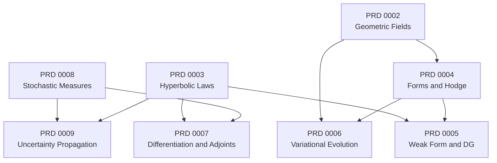

# Mathematical Physics Substrate Architecture Proposal

Date: 2026-07-17

## Status

Draft for owner review in the geometric-field documentation PR. This proposal
organizes future documentation. It does not create a runtime module, implementation
issue, solver capability, or product commitment.

## Decision Summary

Transport Studio should use **Mathematical Physics Substrate** as the documentation
family for geometry, numerical evolution, differentiation, and stochastic inference
shared by Relativistic Multiphysics and Monte Carlo transport.

The family contains eight PRDs. PRD 0002 remains the only active geometric-field
planning gate. PRD 0003 is drafted because Valencia GRHD and Gray M1 provide two
concrete consumers. The other six siblings remain decision-bound outlines until
their activation gates are satisfied.

Mathematical Physics Substrate is not a Rust module or crate. It does not replace
the distinct domain meanings of Geometric Field and Transport Geometry.

## Why One Geometry Package Fails The Deletion Test

A single package spanning sections, differential forms, DG, conservation laws,
symplectic integration, adjoints, probability measures, and uncertainty would have
an interface almost as broad as its implementation. Deleting it would not
concentrate complexity in one place; it would merely restore the real domain seams.
That is a shallow module.

The proposed family instead identifies deep modules whose interfaces can be tested
through real adapters. The common architecture rules are:

- one adapter is a hypothetical seam; two adapters make the seam real;
- the interface is the test surface;
- mathematical machinery stays private unless callers need the mathematical
  identity to use the module correctly;
- every module must pass the deletion test by concentrating behavior that would
  otherwise leak into multiple callers;
- Verification Problems precede product Capability Status changes.

## Portfolio And Dependency Order

The diagram numbers future documents by likely repository sequence. The portfolio
count is eight: existing PRD 0002 plus seven siblings numbered PRD 0003 through
PRD 0009.

### PRD 0002: Geometric Fields And Local Symmetry

**Deep module:** local geometric representation.

**Interface:** sections, samples, charts, frames, connections, gauge actions,
transformation requests, and typed geometry failures.

**Private implementation:** fiber bundles, trivializations, transition dispatch,
and generic Lie-group or representation machinery.

**Adapters:** Cartesian and spherical charts; coordinate and orthonormal frames;
local and Hopf U(1) gauge geometry.

**Verification Problems:** chart/frame round trips, contraction invariance, local
gauge covariance, holonomy, patch transitions, and first Chern number.

**Exclusions:** differential forms, PDE discretization, electromagnetic dynamics,
generic group theory, Kaluza-Klein theory, and every five-dimensional framework.

### PRD 0004: Discrete Differential Forms, Hodge Theory, And Maxwell Geometry

**Deep module:** compatible field calculus over an oriented mesh or cell complex.

Continuum Differential Forms, discrete cochains, and ordinary cell-centered fields
remain distinct representations. Pullback, wedge product, exterior derivative, and
oriented integration are metric-independent; Hodge, codifferential, and constitutive
operations require explicit metric, orientation, and boundary policy.

**Interface:** repository-owned forms or cochains, incidence/orientation operations,
exterior derivative, integration, Hodge operations, decomposition results, and
structure-preservation evidence.

**Private implementation:** exterior algebra dispatch, compatible finite-element
spaces, cochain projections, sparse operators, and topology bookkeeping.

**Adapters required before activation:** an oriented cubical cell-complex adapter for
structured grids and an oriented simplicial cell-complex adapter for unstructured
meshes. Maxwell plus either GRMHD magnetic flux or another field problem whose
degrees of freedom naturally live on different cell dimensions provide the first two
independent consumers.

**Verification Problems:** `d^2 = 0`, discrete Stokes, exact/coexact/harmonic
decomposition, nontrivial harmonic flux, Gauss-constraint behavior, and convergence.

**Activation gate:** name the cubical and simplicial representations and two
consumers. Finite-element exterior calculus claims additionally require a discrete
subcomplex and bounded cochain projection.

The source basis and repository fit are recorded in
[Differential Forms and Exterior Calculus Research](differential-forms-exterior-calculus-research.md).

### PRD 0003: Constraint-Aware Hyperbolic Conservation Laws

**Deep module:** physical conservation-law evaluation independent of spatial
discretization policy.

**Interface:** conservative state, physical flux and source evaluation,
characteristic bounds, admissibility, entropy evidence, constraint lifecycle, and
repository-owned failures.

**Private implementation:** formulation-specific conversions, eigenstructure,
limit checks, and recovery details.

**Adapters:** Valencia GRHD and Gray M1. BSSN constraints consume the constraint
lifecycle vocabulary but do not justify a generic DAE interface.

**Verification Problems:** smooth manufactured convergence, shock and contact
fixtures, conservation budgets, entropy inequality, positivity, realizability,
primitive recovery, and explicit evolved/projected/solved/monitored constraints.

**Activation state:** draft now. The repository already has two consumers and
evidence that numerical policy currently leaks into formulation code.

### PRD 0005: Weak-Form And Discontinuous Galerkin Discretization

**Deep module:** spatial discretization of a physics kernel supplied by PRD 0003.

**Interface:** mesh/basis/quadrature inputs, numerical-flux policy, boundary data,
semidiscrete residual, timestep bounds, and discretization evidence.

**Private implementation:** basis evaluation, quadrature assembly, mass operators,
SBP-compatible operators, limiters, and element-local storage.

**Adapters:** the current finite-volume/finite-difference path and a genuine DG
path evaluating the same physical flux/source kernel.

**Verification Problems:** identical pointwise physical fluxes through both
adapters, polynomial exactness, manufactured order, local and global conservation,
constant-state preservation, shock limiting, positivity, and entropy behavior.

**Activation gate:** PRD 0003 must first extract the physical law from the current
fixed Rusanov/reconstruction/boundary policy. DG is not an adapter to
`FiniteDifferenceOperator`.

### PRD 0006: Variational, Symplectic, And Noether-Aware Evolution

**Deep module:** structure-preserving time or spacetime evolution for systems with
a documented variational structure.

**Interface:** repository-owned state, step request, invariant or momentum-map
evidence, and integration failure.

**Private implementation:** discrete actions, generating functions, symplectic
maps, and multisymplectic assembly.

**Adapters:** existing explicit geodesic integration and a symplectic Hamiltonian
geodesic adapter. A bounded Maxwell fixture becomes the second physics family only
after compatible field calculus exists.

**Verification Problems:** long-time Hamiltonian and momentum behavior versus RK,
time reversibility where applicable, discrete Noether evidence, and bounded Maxwell
structure preservation.

**Activation gate:** specify one Hamiltonian geodesic fixture and the invariants it
is expected to preserve. Do not replace unrelated RK paths.

### PRD 0007: Differentiable Physics And Adjoint Sensitivity

**Deep module:** derivative and dual evidence for repository-owned physics maps.

**Interface:** Jacobian reports, manufactured residuals, sensitivity results,
forward/adjoint pair requests, and reciprocity evidence.

**Private implementation:** jets, automatic differentiation, dual numbers,
symbolic expressions, finite differences, and adjoint assembly.

**Adapters:** the existing Symbolica, Numerica, and centered-finite-difference
gateway adapters; later primitive-recovery, flux/source, and transport-adjoint maps.

**Verification Problems:** three-way derivative agreement, dot-product dual
consistency, forward/adjoint reciprocity, and analytic tally sensitivity.

**Activation gate:** a real forward/adjoint pair must exist before the module claims
adjoint capability. Jet-bundle language stays internal.

### PRD 0008: Stochastic Transport Measures And Estimators

**Deep module:** sampling semantics and statistical evidence for transport histories.

**Interface:** source distributions, weighted histories, stopping outcomes,
estimators, uncertainty estimates, reproducibility records, and packet-to-field
transfer evidence.

**Private implementation:** probability-measure representations, Markov kernels,
sampling transforms, and estimator accumulators.

**Adapters:** native photon histories and relativistic geodesic packets.

**Verification Problems:** analytic free-path law, absorption/escape probabilities,
unbiased weighted tallies, inverse-history-count variance scaling, deterministic
seed/stride replay, and conservative packet deposition.

**Activation gate:** define source and estimator interfaces without leaking measure
types into product contracts.

### PRD 0009: Uncertainty Propagation And Polynomial Chaos

**Deep module:** propagation of uncertain model inputs into observables.

**Interface:** uncertain parameter declarations, ensemble or surrogate requests,
observable statistics, convergence evidence, and validity diagnostics.

**Private implementation:** sampling design, polynomial bases, coefficient
projection, and surrogate evaluation.

**Adapters:** direct ensembles and polynomial chaos evaluated against the same
deterministic physics kernel.

**Verification Problems:** analytic uncertain-model moments, ensemble-versus-chaos
agreement, spectral convergence under smooth parameter dependence, and explicit
failure near shocks or loss of hyperbolicity.

**Activation gate:** material, EOS, opacity, source, or geometry uncertainty must be
first-class. Numerical uncertainty remains separate from deterministic verification
and physical validation.

## Cross-Cutting Mathematical Language

Functional analysis and Sobolev spaces define regularity assumptions, norms, weak
formulations, boundary well-posedness, and convergence criteria for PRDs 0003 through
0006. They are verification and numerical-method language, not runtime value types.

Calculus of variations and Noether's theorem belong to the structure-preserving
evolution PRD. Constraint-manifold and differential-algebraic language may guide
implementation, but callers receive domain-owned constraint outcomes rather than a
generic DAE framework.

Targeted SO(3), Lorentz, and U(1) actions belong to PRD 0002 when they reduce
transformation ambiguity. General representation theory does not become a public
framework.

## Deferred Research Ledger

The following topics stay in the Future-Track Notes Ledger until each has a named
consumer, two real adapters, and a Verification Problem:

- spectral and harmonic evolution, plus wavelet and multiresolution analysis;
- geometric measure theory, cut-cell integration, and low-regularity interfaces;
- conservative remapping and optimal transport;
- homogenization and multiscale effective models;
- persistent homology as analysis rather than kernel behavior;
- Clifford algebra until spin or polarized transport is in scope;
- dynamical-systems analysis until an equilibrium or instability problem is named;
- sheaves, category theory, twistors, noncommutative geometry, and higher categories.

Kaluza-Klein theory and all five-dimensional frameworks are excluded from this
portfolio.

## Publication And Promotion Rules

- PRD 0002 and PRD 0003 remain draft documentation until owner approval.
- PRDs 0004 through 0009 are outlines in this proposal, not separate files or issues.
- No implementation issue is created from this proposal.
- No PRD changes solver registries, frontend contracts, reports, or Capability Status.
- Graduation requires source-backed choices, two adapters at the proposed seam,
  negative/failure cases, convergence or invariant evidence, and an explicit
  capability-review decision.

## Top Recommendation

Deepen Constraint-Aware Hyperbolic Conservation Laws first. Valencia GRHD and Gray
M1 supply two real adapters, and the current fixed finite-volume policy demonstrates
the locality problem. This seam unlocks later DG work without committing the codebase
to a generic PDE package.

## Related Documents

- [PRD 0002: Geometric Fields And Sections](PRD-0002-geometric-field-sections.md)
- [PRD 0003: Constraint-Aware Hyperbolic Conservation Laws](PRD-0003-constraint-aware-hyperbolic-conservation-laws.md)
- [Differential Forms and Exterior Calculus Research](differential-forms-exterior-calculus-research.md)
- [Mathematical Physics Substrate Research Note](mathematical-physics-substrate-research.md)
- [ADR 0009: Geometric-Field Facade And Private Bundle Engine](ADR-0009-geometric-field-facade.md)
- [Future-Track Notes Ledger](future-track-notes-ledger.md)
- [Transport Studio Context](../../CONTEXT.md)
